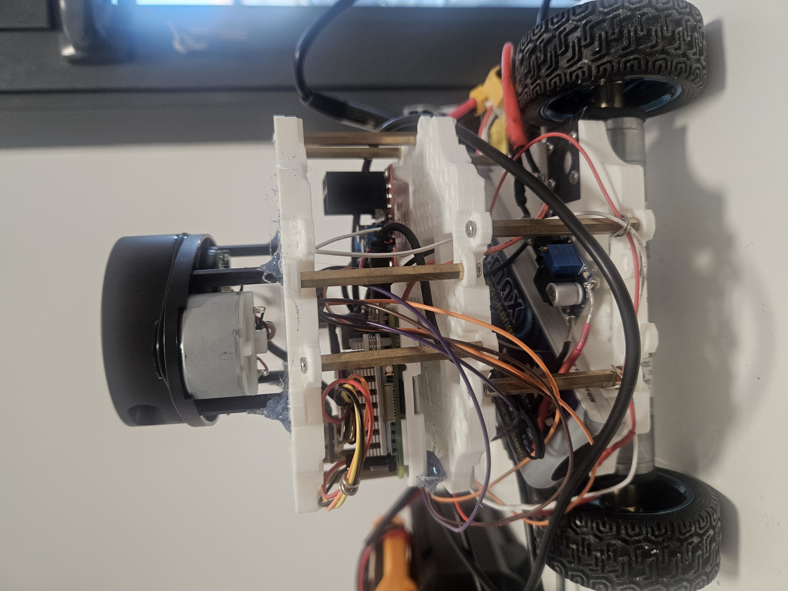
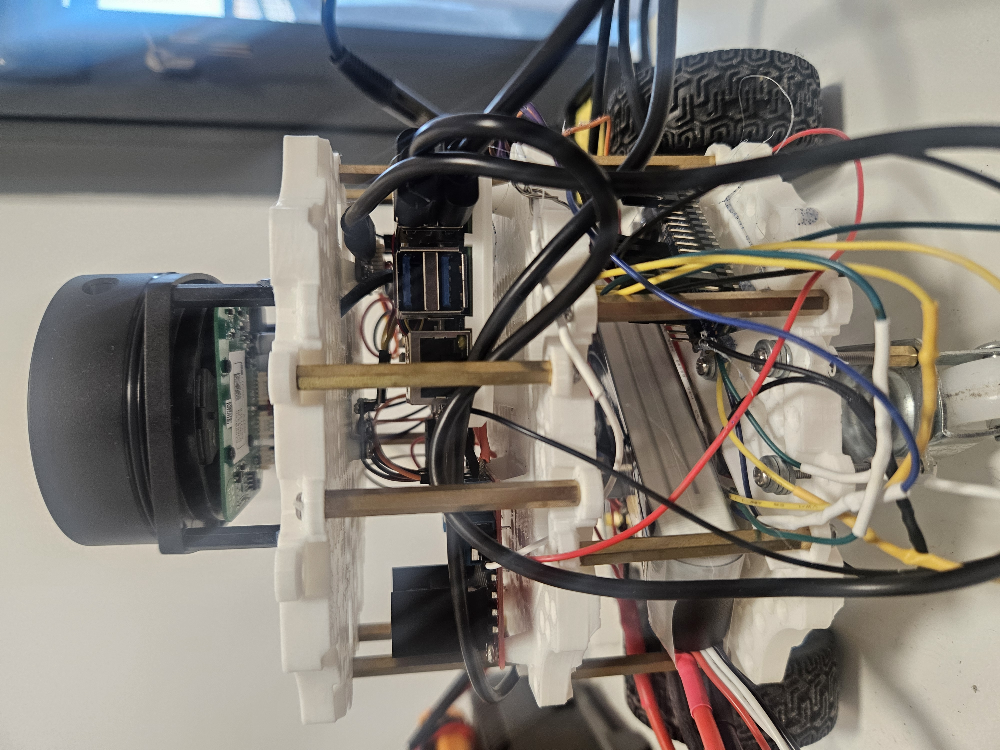
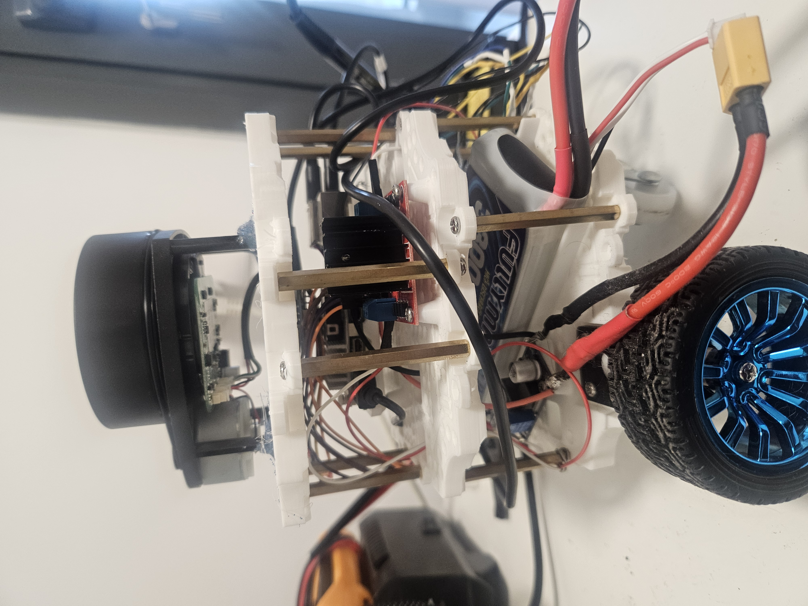
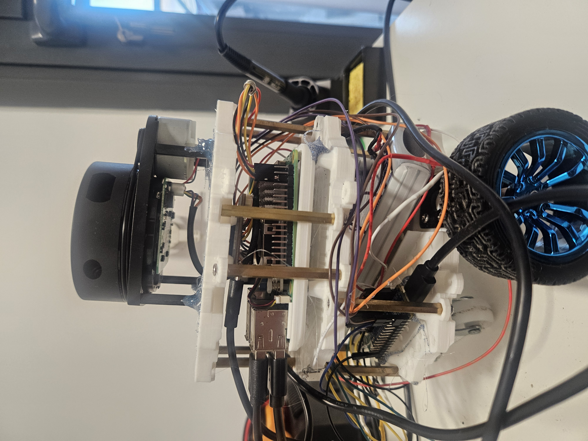
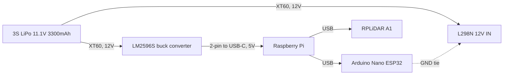

# 🔩 Bumperbot Hardware Guide

This document covers the physical build of the real Bumperbot robot: bill of materials, wiring, and assembly steps. For launching the software stack once the robot is built, see the [Real Hardware](README.md#-real-hardware) section of the main README.

## 📋 Table of Contents

- [Bill of Materials](#-bill-of-materials)
- [Tools Required](#️-tools-required)
- [Chassis & Mechanical Assembly](#️-chassis--mechanical-assembly)
- [Electrical Wiring](#-electrical-wiring)
  - [Power Distribution](#power-distribution)
  - [Battery Safety](#battery-safety)
  - [Motor Driver (L298N)](#motor-driver-l298n)
  - [Encoders](#encoders)
  - [Microcontroller (Arduino) Pinout](#microcontroller-arduino-pinout)
  - [IMU (MPU6050)](#imu-mpu6050)
  - [LiDAR (RPLiDAR A1)](#lidar-rplidar-a1)
- [Raspberry Pi OS & ROS 2 Setup](#️-raspberry-pi-os--ros-2-setup)
- [Device Naming (udev rules)](#-device-naming-udev-rules)
- [Firmware Flashing](#-firmware-flashing)
- [Bring-up Checklist](#-bring-up-checklist)
- [Troubleshooting](#-troubleshooting)

## 🧾 Bill of Materials

Everything used in this build:

| Component | Qty | Notes |
|:---|:---|:---|
| Raspberry Pi 4 or 5 | 1 | Onboard compute, runs this ROS 2 workspace |
| Arduino Nano ESP32 | 1 | Runs `robot_control.ino` over USB serial to the Pi at 115200 baud — **note: 3.3V logic**, unlike classic 5V Nano/Uno boards (see caveat below) |
| L298N dual H-bridge module | 1 | Drives both drive motors |
| JGA25-370 DC gear motor, 12V, 170 RPM, w/ quadrature encoder | 2 | One per driven wheel; firmware assumes 385 encoder counts/output-shaft-rev — rated 12V drives the L298N motor-supply voltage requirement |
| Drive wheel | 2 | Radius `0.033 m` per `bumperbot_controllers.yaml` |
| Caster wheel | 1 | The simulated URDF models 2 casters (`caster_front_link`/`caster_rear_link`), but the real robot only has 1 — see the [heads-up note](#️-chassis--mechanical-assembly) in Chassis & Mechanical Assembly |
| RPLiDAR A1 | 1 | Ships with its own USB adapter board |
| MPU6050 IMU breakout | 1 | I2C, address `0x68` |
| Gamepad | 1 | Bluetooth, exposed as `/dev/input/js0` for `joy`-based teleop |
| LiPo battery, 3S 11.1V nominal, 3300mAh, XT60 connector | 1 | ~12.6V fully charged, matching the JGA25-370's 12V rating — wired straight to the L298N's motor-supply input in parallel with the LM2596S (see [Power Distribution](#power-distribution)) |
| LM2596S buck (step-down) converter | 1 | Input from the LiPo pack, output set to 5V to power the Raspberry Pi |
| XT60 female connector | 1 | Battery-side pigtail — the LiPo's male XT60 plugs in here, then splits in parallel to the L298N and LM2596S (see [Power Distribution](#power-distribution); there's no switch in this build) |
| M3 brass standoff, female-to-female, 45mm | 14 | |
| M3 brass standoff, female-to-female, 7mm | 4 | |
| M3 screws, 8mm and 6mm | ~20 | Exact split between the two lengths not specified |
| M3 nuts | 16 | |
| Jumper wires | — | For Arduino/L298N/MPU6050/encoder signal connections |
| USB-C cable, male-to-2-pin | 1 | Powers the Raspberry Pi from the LM2596S 5V output |
| USB cable, Arduino to Raspberry Pi | 1 | Carries the 115200-baud serial link (`/dev/arduino`) |
| 3D-printed waffle plate (base) | 1 | `cad/waffle_base_plate.STL` — ~137.5 × 137.5 mm footprint, ~16 mm thick |
| 3D-printed waffle plate (middle) | 1 | `cad/waffle_middle_plate.STL` — same footprint, ~16 mm thick |
| 3D-printed waffle plate (roof) | 1 | `cad/waffle_roof_plate.STL` — same footprint, ~12 mm thick |

No power switch or fuse in this build. The Arduino is powered over USB from the Pi, and the L298N derives its own logic supply from the 12V rail via its onboard regulator jumper — see [Power Distribution](#power-distribution) and [Motor Driver](#motor-driver-l298n).

## 🛠️ Tools Required

- 3D printer (Bambu Lab A1 used for this build) — for the `cad/` waffle plates
- Soldering kit
- Multimeter (Fluke)
- Hot glue
- Wire stripper
- Screwdriver
- 3S LiPo charger

## 🏗️ Chassis & Mechanical Assembly

Think of the chassis as a 3-layer sandwich: a **base** plate, a **middle** plate, and a **roof** plate, held apart by brass standoffs. Here's what the finished robot looks like from all four sides, so you have something to compare against as you go:

| Front | Back | Left | Right |
|:---:|:---:|:---:|:---:|
|  |  |  |  |

### Step 1 — Print the three plates

Print all three plates from [`cad/`](cad/):

| Plate | File | Footprint | Thickness |
|:---|:---|:---|:---|
| Base | `cad/waffle_base_plate.STL` | ~137.5 × 137.5 mm | ~16 mm |
| Middle | `cad/waffle_middle_plate.STL` | ~137.5 × 137.5 mm | ~16 mm |
| Roof | `cad/waffle_roof_plate.STL` | ~137.5 × 137.5 mm | ~12 mm |

(These dimensions came straight from each STL's bounding box, so they should match what slices out of the file.)

### Step 2 — Build up the base tier

Working on the base plate first:

1. Mount both **JGA25-370 drive motors**, then attach the **wheels** to their output shafts — these go through `wheel_left_joint`/`wheel_right_joint` in the URDF.
2. Mount the **single caster wheel** underneath the base plate using the **4× M3 7mm brass standoffs**.
3. Set the **Arduino Nano ESP32** in place and **hot-glue** it down (no standoffs here — it's small enough that hot glue holds it fine).
4. Mount the **LM2596S buck converter**.
5. Leave a slot open for the **LiPo battery** — it sits on this tier too, but isn't permanently fixed (you'll want to pull it for charging).

### Step 3 — Stack on the middle tier

Screw **14× M3 45mm brass standoffs** into the base plate's corner/edge holes — these are what give the stack its height. Lower the middle plate down onto them and screw it in place. Once it's up, mount:

- The **Raspberry Pi**
- The **L298N** motor driver

### Step 4 — Stack on the roof tier

Same idea as step 3: more of the 45mm standoffs go between the middle and roof plates. Before you close it up, mount **underneath** the roof plate (so they're sandwiched and out of the way):

- The **MPU6050 IMU**
- The **RPLiDAR A1's USB adapter board**

Once the roof plate is down, **hot-glue the RPLiDAR A1 on top** of it — it needs a clear, unobstructed 360° view to scan properly, so the top of the stack is the only place it can go.

### Step 5 — Wire it up

With everything mounted, move on to [Electrical Wiring](#-electrical-wiring) below to connect power and signal cables between tiers.

---

> **Heads-up:** the simulated URDF uses an older, separate mesh for `base_link` (not these plates) and models 2 casters instead of 1 — its joint offsets are a placement hint, not a verified match to the real build.

## ⚡ Electrical Wiring

### Power Distribution

A single 3S LiPo (11.1V nominal, 3300mAh) feeds everything — no power switch or fuse in this build, so the battery's XT60 connector is the only on/off point. From the battery, power fans out in parallel to two consumers, then cascades down to everything else over USB:



| From | To | Connector / Wiring |
|:---|:---|:---|
| LiPo | LM2596S `IN+`/`IN-` | XT60, red=+, black=GND |
| LiPo | L298N `12V IN`/`GND` | XT60 (in parallel with the LM2596S branch), red=+, black=GND |
| LM2596S `OUT` | Raspberry Pi | 2-pin cable → USB-C |
| Raspberry Pi (USB) | Arduino Nano ESP32 | USB cable — also carries the 115200-baud serial link |
| Raspberry Pi (USB) | RPLiDAR A1 | USB (via the lidar's bundled adapter board) |
| Arduino `GND` | L298N `GND` | Direct wire — ties the Pi-USB-powered logic domain to the battery-powered 12V domain so the `ENA`/`ENB`/`IN1`–`IN4` control signals share a common reference (see [Motor Driver](#motor-driver-l298n)) |

So the Arduino and RPLiDAR don't draw from the LiPo/buck converter directly — they're powered downstream of the Raspberry Pi's own USB ports, off the Pi's 5V rail. The dashed line in the diagram above is that one direct ground wire bridging the two otherwise-separate power domains.

### Battery Safety

This build has no battery-management system, low-voltage cutoff, or fuse — the pack's voltage has to be checked manually:

- **Never let the pack drop below 11.1V** (its nominal voltage). Discharging a LiPo further risks permanently damaging the cells.
- **Check the voltage periodically with the Fluke multimeter**, measured across the battery's XT60 leads.
- **Recharge once it reaches 11.5V**, using the 3S LiPo charger, back up to a full charge of **12.6V**.

Since there's no switch or fuse in this build (see [Power Distribution](#power-distribution)), the only way to stop the pack from discharging is to physically unplug the XT60 connector.

### Motor Driver (L298N)

The Arduino drives each motor channel through the L298N's enable (PWM) and direction pins:

| L298N Pin | Arduino Pin | Purpose |
|:---|:---|:---|
| `ENA` | `D9` | Right motor speed (PWM) |
| `IN1` | `D12` | Right motor direction bit 1 |
| `IN2` | `D13` | Right motor direction bit 2 |
| `ENB` | `D11` | Left motor speed (PWM) |
| `IN3` | `D7` | Left motor direction bit 1 |
| `IN4` | `D8` | Left motor direction bit 2 |
| `GND` | `GND` | Common ground reference between the Arduino's (Pi-USB-powered) logic and the L298N's (battery-powered) 12V domain — required for the `ENA`/`ENB`/`IN1`–`IN4` signal levels to read correctly |

Motor supply is the 3S LiPo's 12V (nominal 11.1V) wired straight to the L298N's `12V IN`/`GND` screw terminals — see [Power Distribution](#power-distribution). The onboard 5V logic-supply jumper is **installed**, so the L298N derives its own internal logic supply from the 12V rail rather than needing a separate 5V feed.

Motor leads: **right motor → `OUT1`/`OUT2`**, **left motor → `OUT3`/`OUT4`** (matching the `IN1`/`IN2`=right, `IN3`/`IN4`=left pairing above), standard polarity. (Note: motor leads on `OUT1`–`OUT4` must be wired consistently per side — a prior build issue traced "only one motor spins" to a miswiring here, not firmware.)

### Encoders

Both wheels use quadrature encoders read directly by the Arduino via pin-change interrupts on the A phase:

| Signal | Arduino Pin |
|:---|:---|
| Right encoder phase A (interrupt) | `D3` |
| Right encoder phase B (direction) | `D5` |
| Left encoder phase A (interrupt) | `D2` |
| Left encoder phase B (direction) | `D4` |
| Encoder `VCC` (both) | `3.3V` |
| Encoder `GND` (both) | `GND` |

`robot_control.ino` counts pulses on phase A and reads phase B's level at each pulse to determine direction. Pulses are converted to angular velocity assuming 385 counts per output-shaft revolution — if your encoder/gearbox has a different PPR, this constant must be updated in the firmware.

The Hall-effect encoders on each JGA25-370 are powered from the Arduino's 3.3V pin (shared ground), not from the motor's own 12V leads — only the phase A/B signal wires and this 3.3V/GND pair connect to the Arduino; the motor's power leads go to the L298N's `OUT1`–`OUT4` as covered in [Motor Driver](#motor-driver-l298n).

### Microcontroller (Arduino) Pinout

Board: **Arduino Nano ESP32**. Consolidated pin map for `robot_control.ino` (the `Dn` labels below are the silkscreen/`Arduino` numbering on the Nano form factor, not raw ESP32 GPIO numbers):

| Arduino Pin | Function |
|:---|:---|
| `D2` | Left encoder phase A (interrupt) |
| `D3` | Right encoder phase A (interrupt) |
| `D4` | Left encoder phase B |
| `D5` | Right encoder phase B |
| `D7` | L298N `IN3` (left direction) |
| `D8` | L298N `IN4` (left direction) |
| `D9` | L298N `ENA` (right speed, PWM) |
| `D11` | L298N `ENB` (left speed, PWM) |
| `D12` | L298N `IN1` (right direction) |
| `D13` | L298N `IN2` (right direction) |
| USB / Serial | 115200 baud link to the Raspberry Pi (`/dev/arduino`), consumed by `BumperbotInterface` |

**On other Nano-form-factor boards:** `robot_control.ino` only uses portable Arduino core calls (`digitalWrite`, `analogWrite`, `attachInterrupt`, `Serial`, plus the vendored `PID_v1` library) — nothing ESP32-specific — so it should compile for a classic Nano/Nano Every/Nano 33 IoT/etc. with just an FQBN change, and `attachInterrupt` works on every digital pin on the ESP32 core (unlike classic AVR Nanos, which restrict it to D2/D3 — already satisfied here anyway). The real incompatibility risk is **electrical, not firmware**: the Nano ESP32 is a **3.3V logic** board, while the classic Nano/Uno/Nano Every are 5V. Most L298N modules treat anything above ~2V as a logic HIGH, so 3.3V control signals normally work — but this hasn't been verified against this specific L298N module, and a straight swap to a 5V-logic Nano would need no such check. Don't assume compatibility across boards without re-verifying the logic-level threshold of your L298N module.

### IMU (MPU6050)

Read by `mpu6050_driver.py` over I2C:

| MPU6050 Pin | Raspberry Pi Pin | Purpose |
|:---|:---|:---|
| `VCC` | 3.3V (physical pin 1) | Power |
| `GND` | GND (physical pin 6, or any GND) | Ground |
| `SCL` | GPIO3 / SCL (physical pin 5) | I2C clock — bus `/dev/i2c-1` |
| `SDA` | GPIO2 / SDA (physical pin 3) | I2C data — bus `/dev/i2c-1` |

Device I2C address is fixed at `0x68` in the driver. Mounting orientation/location is covered in [Chassis & Mechanical Assembly](#️-chassis--mechanical-assembly).

### LiDAR (RPLiDAR A1)

The A1 ships with its own USB-to-serial adapter board, so it connects to the Raspberry Pi over USB rather than to the Arduino:

| Parameter | Value | Source |
|:---|:---|:---|
| Connection | USB (via RPLiDAR A1's bundled adapter board) | — |
| Serial baud rate | `115200` | `bumperbot_bringup/config/rplidar_a1.yaml` |
| Expected device path | `/dev/rplidar` | see [Device Naming](#-device-naming-udev-rules) |
| `frame_id` | `laser_link` | must match the URDF link the lidar is physically mounted at |

Physical mounting position/orientation is covered in [Chassis & Mechanical Assembly](#️-chassis--mechanical-assembly) — the lidar's yaw relative to `base_link` must match the URDF joint, or scans will appear mirrored/rotated in RViz.

## 🖥️ Raspberry Pi OS & ROS 2 Setup

Before any of the wiring above does anything useful, the Raspberry Pi needs an OS and the ROS 2 stack on it.

1. **Flash Ubuntu Server (64-bit) onto the Pi's SD card** using Raspberry Pi Imager — pick **22.04** if you're going to run **ROS 2 Humble**, or **24.04** for **ROS 2 Jazzy** (must match; see the main [README Prerequisites](README.md#-prerequisites)).
2. **Enable I2C**, required for the MPU6050 (`mpu6050_driver.py` talks to it over `/dev/i2c-1` via the `smbus` Python module):
   ```bash
   sudo raspi-config  # Interface Options -> I2C -> Enable
   # or, headless: add/uncomment `dtparam=i2c_arm=on` in /boot/firmware/config.txt, then reboot
   sudo apt install python3-smbus i2c-tools
   ```
3. **Add your user to the `dialout` and `i2c` groups**, so ROS 2 nodes can open the Arduino's serial port and the I2C bus without root:
   ```bash
   sudo usermod -aG dialout,i2c $USER
   # log out and back in for group changes to take effect
   ```
4. **Install ROS 2 and this workspace's dependencies** — follow the main README's [Prerequisites](README.md#-prerequisites) and [Quick Start](README.md#-quick-start) sections (ROS 2, Nav2, ros2_control, robot_localization, libserial-dev, rplidar_ros), then clone and `colcon build` this workspace on the Pi itself.
5. Continue to [Device Naming](#-device-naming-udev-rules) below to make the Arduino and RPLiDAR show up at stable paths before first launch.

## 🔌 Device Naming (udev rules)

The Arduino and RPLiDAR normally show up as `/dev/ttyACM0`/`/dev/ttyUSB0`-style names, and Linux doesn't guarantee which number each gets on every boot/replug. But `bumperbot_ros2_control.xacro` hardcodes `/dev/arduino` and `rplidar_a1.yaml` hardcodes `/dev/rplidar` — so udev rules are needed to symlink each device to a stable name based on its USB vendor/product ID.

1. **Plug in one device at a time** and find its IDs:
   ```bash
   lsusb                              # note the Bus/Device and "ID vvvv:pppp"
   udevadm info -a -n /dev/ttyACM0    # or /dev/ttyUSB0 — confirm idVendor/idProduct/serial
   ```
   Do this once for the Arduino Nano ESP32 and once for the RPLiDAR A1's USB adapter — they should have different vendor IDs (the Nano ESP32 uses Espressif's native USB; the RPLiDAR adapter is typically a CP2102 or CH340 chip), so matching on vendor/product alone should be enough to tell them apart. If you ever add a second device with the same vendor/product ID, match on `ATTRS{serial}` instead.

2. **Create `/etc/udev/rules.d/99-bumperbot.rules`** with one line per device, using the IDs you found in step 1:
   ```
   SUBSYSTEM=="tty", ATTRS{idVendor}=="<arduino_vendor_id>", ATTRS{idProduct}=="<arduino_product_id>", SYMLINK+="arduino", MODE="0666"
   SUBSYSTEM=="tty", ATTRS{idVendor}=="<rplidar_vendor_id>", ATTRS{idProduct}=="<rplidar_product_id>", SYMLINK+="rplidar", MODE="0666"
   ```

3. **Reload udev and re-plug both devices:**
   ```bash
   sudo udevadm control --reload-rules
   sudo udevadm trigger
   ```

4. **Verify:**
   ```bash
   ls -l /dev/arduino /dev/rplidar
   ```
   Both should now point at the correct `ttyACM*`/`ttyUSB*` device regardless of plug order or which USB port is used.

## 💾 Firmware Flashing

The Arduino Nano ESP32 runs `bumperbot_firmware/firmware/robot_control/robot_control.ino` — this is the only sketch consumed by the ROS 2 stack (via `BumperbotInterface`/`bumperbot_ros2_control.xacro`). The other sketches under `firmware/` (`simple_motor_control`, `simple_encoder_reader`, `simple_serial_transmitter`, `simple_serial_receiver`) are standalone diagnostics for testing one piece of hardware at a time — useful for bring-up/troubleshooting, but not part of normal operation.

1. **Install the Arduino IDE** (3.0) on your dev machine — flashing is normally done from a separate computer over USB, not from the Raspberry Pi.
2. **Install the Nano ESP32's board package:** `Tools > Board > Boards Manager`, search for "Arduino Nano ESP32", install **"Arduino ESP32 Boards"** (published by Arduino, not the community `esp32` by Espressif core). Select **Board: "Arduino Nano ESP32"** (FQBN `arduino:esp32:nano_nora` — confirm this matches what your IDE shows, since FQBNs can shift between core versions).
3. **Install the vendored PID library:** copy `bumperbot_firmware/firmware/libraries/PID` into your Arduino sketchbook's `libraries/` folder (or `Sketch > Include Library > Add .ZIP Library...` after zipping it). `robot_control.ino` depends on this for `#include <PID_v1.h>`.
4. **Open `robot_control.ino`**, select the Nano ESP32's serial port under `Tools > Port` (it'll show up as a generic `ttyACM*`/`COM*` port before the [udev rule](#-device-naming-udev-rules) is in place), and click **Upload**.
5. **Verify over Serial Monitor** at **115200 baud**: with the wheels free to spin, you should see lines like `r p<value>,l p<value>,` (right/left encoder velocity readings) printed continuously once `loop()` starts — see the `Serial.println(encoder_read)` call in `robot_control.ino`.

Re-flash any time you change a PID gain, the 385-count/rev encoder constant, or a pin assignment in `robot_control.ino`.

## ✅ Bring-up Checklist

Work through these in order — each step assumes the previous ones passed. **Prop the robot up with its wheels off the ground until the "First drive" step** — that way a wiring mistake spins a wheel in mid-air instead of driving the robot into something.

### Before powering on

- [ ] Battery reads ≥11.1V on the Fluke (see [Battery Safety](#battery-safety)) — recharge first if not.
- [ ] XT60 polarity correct on both branches (LiPo → L298N, LiPo → LM2596S).
- [ ] Arduino `GND` ↔ L298N `GND` wire is connected (see [Motor Driver](#motor-driver-l298n)).
- [ ] Wheels spin freely by hand, nothing snagging the wiring.

### First power-on

- [ ] Plug in the XT60 — there's no switch, so this *is* power-on.
- [ ] Raspberry Pi boots (status LED activity).
- [ ] Arduino Nano ESP32's LED lights up once the Pi enumerates it over USB.
- [ ] RPLiDAR A1 spins up.

### Software checks (on the Pi)

```bash
ls -l /dev/arduino /dev/rplidar     # udev symlinks exist (see Device Naming)
groups                              # confirm you're in dialout and i2c
i2cdetect -y 1                      # expect a device at address 0x68 (MPU6050)
source install/setup.bash
```

### Component smoke tests (wheels still off the ground)

There's no per-component launch file in this repo, so bring up the full stack now and check each piece from there — that's exactly why the wheels need to stay off the ground for this part:

```bash
ros2 launch bumperbot_bringup real_robot.launch.py use_slam:=false
```

- [ ] **IMU:** `ros2 topic echo /imu/out` (published by `mpu6050_driver.py`) — values should look sane, not all-zero, with the accelerometer roughly showing gravity on one axis.
- [ ] **Lidar:** `ros2 topic echo /scan --once` — ranges should be populated, not all `inf`.
- [ ] **Encoders:** spin a wheel by hand and confirm the count changes — either via the Arduino's serial monitor (115200 baud, disconnect/reconnect the Serial Monitor since the Pi already holds the port) or `ros2 topic echo /joint_states`.
- [ ] **Motors:** command a small `/cmd_vel` and confirm each wheel spins in the *correct* direction for that command — this is exactly the kind of check that would have caught the [L298N `OUT1`–`OUT4` miswiring](#motor-driver-l298n) ("only one motor spins") before it became a driving problem.
- [ ] **Gamepad:** pair the Bluetooth controller and confirm `/joy` publishes button/axis values when you move the sticks.

### First drive

With `real_robot.launch.py` still running from the smoke tests above:

- [ ] Raspberry Pi and your dev machine are on the **same network** and have the **same `ROS_DOMAIN_ID`** exported — otherwise the dev machine's RViz/CLI tools won't see any of the Pi's topics, even though the robot itself is running fine.
- [ ] `real_robot.launch.py` doesn't spawn RViz itself, so open it on your dev machine (same ROS network as the Pi) with the config matching your `use_slam` value:
  - `use_slam:=false` (AMCL): `rviz2 -d $(ros2 pkg prefix nav2_bringup)/share/nav2_bringup/rviz/nav2_default_view.rviz`
  - `use_slam:=true` (SLAM Toolbox): `rviz2 -d src/bumperbot_mapping/rviz/slam.rviz`

  Confirm `/scan`, `/tf`, and (in SLAM mode) `/map` all look sane before trusting anything autonomous.
- [ ] Confirm `/safety_stop` reads `false` at rest. `twist_mux` treats this topic as a priority-255 lock — if it's latched `true` with nothing nearby, every `cmd_vel` source (joystick, Nav2, recovery behaviors) is cut and the robot won't move no matter what you command. More on this in [Troubleshooting](#-troubleshooting).
- [ ] Drive via joystick at low speed with the wheels still off the ground — confirm forward/turn directions match the stick input.
- [ ] Only once that all checks out, set the robot down and test-drive slowly in an open area, watching `/odom` for sane values as it moves.
- [ ] In `nav2_default_view.rviz` (AMCL mode), use the **"Nav2 Goal"** button to set a goal location on the map, then watch bumperbot navigate to it autonomously — same demo as the [README's GIF](README.md), now on real hardware instead of simulation.

## 🩹 Troubleshooting

| Symptom | Likely cause | Check / fix |
|:---|:---|:---|
| Robot completely frozen — joystick, Nav2, **and** recovery behaviors (e.g. the spin recovery) all fail to move it | `/safety_stop` latched `true`, which `twist_mux` treats as a **priority-255 lock** — cuts every `cmd_vel` source until it clears | `ros2 topic echo /safety_stop`. If `true`, something is inside `danger_distance` (`0.1m` by default per the README's [Real Hardware](README.md#-real-hardware) section). If it's latching in open space or tight corners, tune `danger_distance`/`warning_distance` on the `safety_stop` node in `real_robot.launch.py` |
| Only one wheel ever spins, and *which* wheel fails flips between runs (not always the same side) | Physical wiring fault at the L298N's `OUT1`–`OUT4` terminals — not firmware, PID, encoders, or power supply | Re-check the motor lead wiring at the L298N outputs per side (see [Motor Driver](#motor-driver-l298n)). This exact symptom was traced to a miswiring here before, not code |
| `/dev/arduino` or `/dev/rplidar` don't exist | udev rule missing, not reloaded, or vendor/product IDs don't match your actual hardware | Re-check [Device Naming](#-device-naming-udev-rules); confirm with `lsusb` / `udevadm info` that the IDs in your rule file match what's actually plugged in |
| `i2cdetect -y 1` shows nothing at `0x68` | I2C not enabled on the Pi, or MPU6050 wiring/power issue | Re-check [Raspberry Pi OS & ROS 2 Setup](#️-raspberry-pi-os--ros-2-setup) step 2 (I2C enable) and the [IMU wiring](#imu-mpu6050) |
| Permission denied opening the serial port or I2C bus | User not in `dialout`/`i2c` groups (or didn't re-login after `usermod`) | `groups` to check; log out/in (or reboot) after adding yourself |
| Dev machine's RViz/CLI tools see no topics, but the robot seems to be running fine on the Pi | Pi and dev machine aren't on the same network, or have different `ROS_DOMAIN_ID` | Confirm both with `echo $ROS_DOMAIN_ID` on each machine, and that they can ping each other |
| Robot behaves erratically, randomly reboots, or motors seem underpowered | Battery sagging below a safe voltage under load | Check with the Fluke per [Battery Safety](#battery-safety) — recharge if at/below 11.5V |
| Lidar scans look mirrored or rotated in RViz | RPLiDAR's physical mounting yaw doesn't match the `laser_joint` orientation assumed in the URDF | Re-check mounting orientation per [LiDAR wiring](#lidar-rplidar-a1); a prior fix for this exact issue is in the project history as a "180-degree yaw mismatch" |
