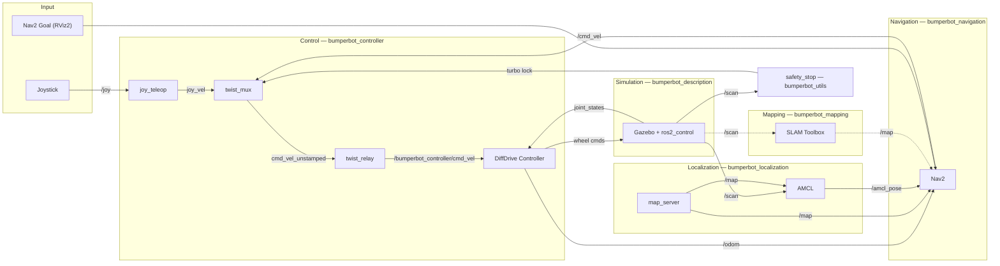

# 🤖 Bumperbot ROS2 Workspace

[](https://docs.ros.org/en/humble/)
[](https://docs.ros.org/en/jazzy/)
[](https://ubuntu.com/)
[](LICENSE.md)

This workspace contains the packages and resources for the "Bumperbot" mobile robot. It includes core bringup and control stacks, localization and mapping tools, message definitions, examples in C++ and Python, and shared utilities. This workspace is influenced by the series-courses **Self Driving and ROS 2 - Learn by Doing**, made by Antonio Brandi.

> **Note:** This workspace is currently simulation-focused. Real hardware support is under development.

[](assets/navigation-video.mp4)

## 📋 Table of Contents

- [Courses](#-courses)
- [Prerequisites](#-prerequisites)
- [Quick Start](#-quick-start)
- [Architecture](#️-architecture)
- [Project Structure](#️-project-structure)
- [Running](#️-running)
- [Contributing](#-contributing)
- [Contact](#-contact)

## 🎓 Courses

- [Odometry & Control](https://www.udemy.com/course/self-driving-and-ros-2-learn-by-doing-odometry-control)
- [Map & Localization](https://www.udemy.com/course/self-driving-and-ros-2-learn-by-doing-map-localization)
- [Plan & Navigation](https://www.udemy.com/course/self-driving-and-ros-2-learn-by-doing-plan-navigation)

## 📦 Prerequisites

- Ubuntu 22.04 (Humble) or Ubuntu 24.04 (Jazzy)
- ROS 2: [Humble](https://docs.ros.org/en/humble/Installation.html) or [Jazzy](https://docs.ros.org/en/jazzy/Installation.html)
- Gazebo Classic (comes with `ros-humble-desktop`) or Gazebo Harmonic (comes with `ros-jazzy-desktop`)
- Nav2: `sudo apt install ros-$ROS_DISTRO-navigation2 ros-$ROS_DISTRO-nav2-bringup`
- ros2_control: `sudo apt install ros-$ROS_DISTRO-ros2-control ros-$ROS_DISTRO-ros2-controllers`
- robot_localization: `sudo apt install ros-$ROS_DISTRO-robot-localization`
- libserial: `sudo apt install libserial-dev`

## 🚀 Quick Start

1. Source the ROS 2 underlay (replace `humble` with `jazzy` if applicable):
```bash
source /opt/ros/$ROS_DISTRO/setup.bash
```
2. Clone the workspace and navigate to it:
```bash
git clone https://github.com/Matan-Vinkler/bumperbot.git bumperbot_ws
cd bumperbot_ws
```
3. Build the workspace:
```bash
colcon build --executor sequential  # sequential to avoid overloading the CPU/memory during build
```
4. Source the workspace (in a new shell):
```bash
source install/setup.bash
```
5. Run a bringup or controller launch, for example:
```bash
ros2 launch bumperbot_bringup simulated_robot.launch.py world_name:=small_house
```
6. In RViz2, use the "Nav2 Goal" button to point a goal location on the map and watch bumperbot autonomously navigate there. See the GIF at the top of this page for a demo.

> **Joystick:** A gamepad connected on `/dev/input/js0` is detected automatically — no extra launch step needed. Teleop is bundled into the main bringup.

## 🏗️ Architecture

The diagram below shows the main data flow between runtime subsystems.



> Dashed lines (`-.->`) are active only when `use_slam:=true`. In the default mode (`use_slam:=false`), `map_server` serves a pre-built map and AMCL localizes against it.

## 🗂️ Project Structure

Top-level `src/` contains the following packages:

| Package | Purpose | Notes |
|:---|:---|:---|
| `bumperbot_bringup` | Top-level launch files for simulation and hardware bring-up | Entry point for most use cases |
| `bumperbot_controller` | Controller implementations and joystick teleop integration | Provides both C++ and Python controllers with configuration files |
| `bumperbot_mapping` | Mapping nodes and utilities for building and serving environment maps | |
| `bumperbot_localization` | Localization and state-estimation nodes for accurate robot pose tracking | Integrates with `robot_localization` and Nav2 lifecycle components |
| `bumperbot_navigation` | High-level navigation layer wrapping a Nav2-based stack | Configures custom planner/motion plugins with Nav2 servers |
| `bumperbot_description` | Robot URDF/Xacro, meshes, and RViz/Gazebo launch helpers | |
| `bumperbot_firmware` | Embedded firmware for the microcontroller and low-level hardware interfaces | Motor control, sensor interfacing, and hardware communication protocols |
| `bumperbot_msgs` | Custom message and action definitions used across the workspace | |
| `bumperbot_cpp_examples` | Example C++ nodes demonstrating rclcpp, actions, components, and TF | Good reference for ROS 2 C++ best practices |
| `bumperbot_py_examples` | Example Python nodes demonstrating rclpy, TF, and custom messages | |
| `bumperbot_utils` | Utility libraries and helper nodes shared across packages | |
| `bumperbot_planning` | Planning and trajectory generation nodes for high-level path planning | Integrates with controllers and navigation stacks |
| `bumperbot_motion` | Motion layer utilities and trajectory followers | Bridges high-level planners with low-level controllers |

## ▶️ Running

### 🌍 Simulation Worlds

Pass `world_name:=<world>` to the bringup launch file:

| `world_name` | Description |
|:---|:---|
| `empty` | Empty flat world |
| `small_house` | Indoor house environment |
| `small_warehouse` | Industrial warehouse environment |

### ⚙️ Key Launch Arguments

| Argument | Default | Description |
|:---|:---|:---|
| `world_name` | `small_house` | Gazebo world to load (see table above) |
| `use_slam` | `false` | `true` = build map with SLAM Toolbox; `false` = localize with AMCL |
| `use_simple_controller` | `true` | Use the custom simple controller instead of the ros2_control diff-drive controller |
| `use_python` | `false` | Use the Python controller implementation instead of C++ |
| `wheel_radius` | `0.033` | Wheel radius in metres |
| `wheel_separation` | `0.17` | Distance between wheels in metres |

### 💻 Commands

- Source the workspace before any `ros2` command: `source install/setup.bash`
- Run a specific launch file: `ros2 launch <package> <launchfile>`
- Run C++ examples: `ros2 run bumperbot_cpp_examples <executable>`
- Run Python examples: `ros2 run bumperbot_py_examples <node>`

## 🤝 Contributing

Open a branch, make small, well-scoped changes, and submit a PR. Update this README when adding new top-level functionality.

## 📬 Contact

Maintainer: [matan](mailto:matanvinkler@gmail.com)
